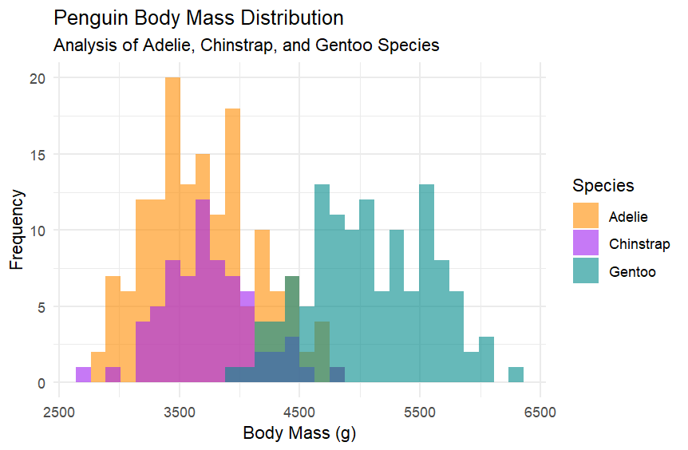
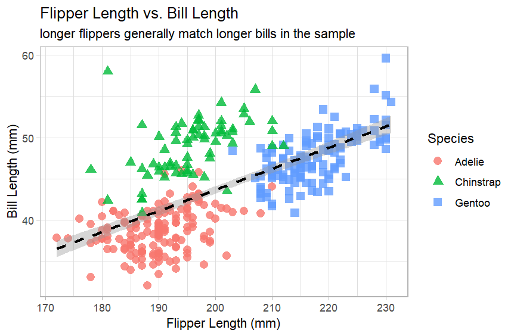
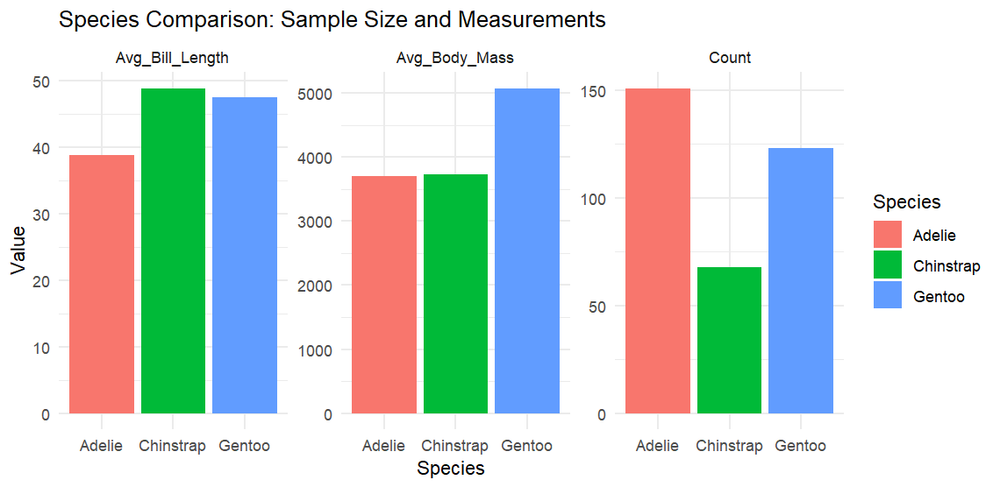

# Finals R Project

**Author:** Fritz Harly G. Degamo

This project is a finals requirement for R/RStudio covering core programming structures, functions, visualization, and basic data science using the `palmerpenguins` dataset.

## Project Overview

The project contains **12 R scripts** organized into six required categories:

- `a. For Loops`
- `b. While Loops`
- `c. Repeat Loops`
- `d. Functions`
- `e. Data Visualization`
- `f. Data Science`

Each category includes **two scripts**, following the project requirement in [project-desc-and-req.md](project-desc-and-req.md).

## Dataset

This project uses the `palmerpenguins` package dataset.

Physical copies are included in [data/penguins.csv](data/penguins.csv) and [data/penguins_raw.csv](data/penguins_raw.csv).

- `penguins.csv` is the cleaned dataset used by the scripts
- `penguins_raw.csv` is the original raw dataset

## Folder Structure

```text
Finals_R_Project/
|-- data/
|   |-- penguins.csv
|   `-- penguins_raw.csv
|-- output/
|   |-- generated csv files
|   `-- plot images
|-- scripts/
|   |-- A_For_Loops_Inventory.R
|   |-- A_For_Loops_Summary_Table.R
|   |-- B_While_Loops_First_10_Species.R
|   |-- B_While_Loops_Max_Min_Avg.R
|   |-- C_Repeat_Loops_Find_Dream_Island.R
|   |-- C_Repeat_Loops_Accumulate_Bills.R
|   |-- D_Functions_Convert_Kg.R
|   |-- D_Functions_Deviation_Table.R
|   |-- E_Visualization_Body_Mass_Histogram.R
|   |-- E_Visualization_Flipper_vs_Bill.R
|   |-- F_DataScience_Clean_Subsets.R
|   `-- F_DataScience_Linear_Regression.R
`-- README.md
```

## Scripts

| Category | Script | Purpose |
|---|---|---|
| For Loops | `A_For_Loops_Inventory.R` | loops through dataset columns and reports each column type |
| For Loops | `A_For_Loops_Summary_Table.R` | calculates the average of numeric measurement columns |
| While Loops | `B_While_Loops_First_10_Species.R` | prints the first 10 penguin species entries |
| While Loops | `B_While_Loops_Max_Min_Avg.R` | finds the maximum minimum and average body mass |
| Repeat Loops | `C_Repeat_Loops_Find_Dream_Island.R` | finds the first row from Dream island |
| Repeat Loops | `C_Repeat_Loops_Accumulate_Bills.R` | adds bill lengths until the total reaches 200 mm |
| Functions | `D_Functions_Convert_Kg.R` | converts body mass from grams to kilograms |
| Functions | `D_Functions_Deviation_Table.R` | builds a deviation table from the average body mass |
| Data Visualization | `E_Visualization_Body_Mass_Histogram.R` | creates a histogram of body mass by species |
| Data Visualization | `E_Visualization_Flipper_vs_Bill.R` | creates a scatter plot of flipper length vs bill length |
| Data Science | `F_DataScience_Clean_Subsets.R` | cleans species subsets and compares summary metrics |
| Data Science | `F_DataScience_Linear_Regression.R` | fits a linear regression model to predict body mass |

## How To Run

### What You Need To Install

A user needs to have these installed first:

- `R`
- `RStudio` recommended
- R packages: `palmerpenguins`, `ggplot2`, `tidyverse`

### Install The Required Packages

Run this once in the R console:

```r
install.packages(c("palmerpenguins", "ggplot2", "tidyverse"))
```

### Open The Project

1. Open `Finals_R_Project.Rproj` in RStudio
2. Make sure the working directory is the project root
3. Open any script inside the `scripts/` folder

### Run The Scripts In RStudio

You can run a script in either of these ways:

1. Open the script and click `Source`
2. Run this in the R console

```r
source("scripts/A_For_Loops_Inventory.R")
source("scripts/A_For_Loops_Summary_Table.R")
source("scripts/B_While_Loops_First_10_Species.R")
source("scripts/B_While_Loops_Max_Min_Avg.R")
source("scripts/C_Repeat_Loops_Find_Dream_Island.R")
source("scripts/C_Repeat_Loops_Accumulate_Bills.R")
source("scripts/D_Functions_Convert_Kg.R")
source("scripts/D_Functions_Deviation_Table.R")
source("scripts/E_Visualization_Body_Mass_Histogram.R")
source("scripts/E_Visualization_Flipper_vs_Bill.R")
source("scripts/F_DataScience_Clean_Subsets.R")
source("scripts/F_DataScience_Linear_Regression.R")
```

### Run One Script Example

```r
source("scripts/E_Visualization_Body_Mass_Histogram.R")
```

### Notes About Running

- the scripts use the `palmerpenguins` package directly
- the physical dataset copies in `data/` are included for documentation and submission
- generated tables and saved outputs are placed in `output/`

## Generated Outputs

The project now includes generated csv outputs in [output](output) for the data frames created by the scripts, excluding the original dataset files stored in `data/`.

Examples:

- [output/D_Functions_Convert_Kg_penguins_kg.csv](output/D_Functions_Convert_Kg_penguins_kg.csv)
- [output/D_Functions_Deviation_Table_summary_table.csv](output/D_Functions_Deviation_Table_summary_table.csv)
- [output/F_DataScience_Clean_Subsets_adelie_clean.csv](output/F_DataScience_Clean_Subsets_adelie_clean.csv)
- [output/F_DataScience_Clean_Subsets_chinstrap_clean.csv](output/F_DataScience_Clean_Subsets_chinstrap_clean.csv)
- [output/F_DataScience_Clean_Subsets_gentoo_clean.csv](output/F_DataScience_Clean_Subsets_gentoo_clean.csv)

## Visualization Outputs

### Body Mass Histogram



This plot compares the distribution of penguin body mass across Adelie, Chinstrap, and Gentoo species. Gentoo penguins tend to appear in the heavier body mass range, while Adelie and Chinstrap are generally lower.

### Flipper Length vs Bill Length



This scatter plot shows a positive relationship between flipper length and bill length. The dashed regression line suggests that penguins with longer flippers also tend to have longer bills in this sample.

### Species Comparison



This figure compares species-level summary metrics. It shows differences in sample size, average bill length, and average body mass, helping reveal how Gentoo differs from Adelie and Chinstrap in overall size.

## Explanation For Data Visualization Scripts

### `E_Visualization_Body_Mass_Histogram.R`

This script creates a histogram to compare the distribution of body mass across the three penguin species. The main purpose is to show how the weight of Adelie, Chinstrap, and Gentoo penguins differs across the dataset. The result makes it easier to see that Gentoo penguins are generally heavier, while Adelie and Chinstrap are grouped more in the lower body mass ranges.

### `E_Visualization_Flipper_vs_Bill.R`

This script creates a scatter plot to examine the relationship between flipper length and bill length. The graph helps show whether larger flipper measurements tend to match larger bill measurements. The regression line and species-based colors make the trend easier to interpret and show that there is a positive relationship in the sample.

## Explanation For Data Science Scripts

### `F_DataScience_Clean_Subsets.R`

This script cleans the penguin data by removing missing values and splitting the dataset into separate subsets for Adelie, Chinstrap, and Gentoo. It then creates a comparison table and reshapes the result for plotting. The goal is to make species-level differences easier to inspect.

### `F_DataScience_Linear_Regression.R`

This script applies a simple linear regression model where `body_mass_g` is predicted using `bill_length_mm`. The output shows the model summary and a sample prediction for a penguin with a 45 mm bill length. The script is meant to demonstrate a basic predictive workflow in R.

## Notes

- all scripts run successfully from start to finish
- comments were revised for readability and consistency
- outputs are stored locally inside `output/`
- source dataset copies are stored locally inside `data/`
